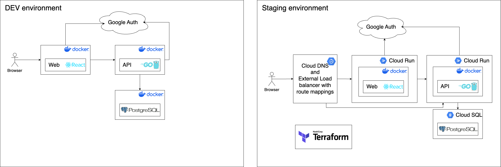

- [Context](#context)
- [Requirements](#requirements)
- [Technology](#technology)
  - [High level view:](#high-level-view)
- [Building](#building)
  - [Run on docker](#run-on-docker)
  - [Run on GCP](#run-on-gcp)
- [Other useful links](#other-useful-links)

## Context

This project is meant as a playground for learning Full-Stack development but it is my hope that it will continue to evolve into something useful one day.

It is dockerized and ready for deployment in GCP.
See docker-compose.yml and /deploy Terraform files.

Terraform has currently some sections commented out to speed up iteration but for initial run, they are required.

## Requirements

Customer authentication:
  - (must) signup with google
  - (must) login with google
  - (must) get profile
  - (nice) update nickname

Exercises input:
  - (must) create
      - (must) name
      - (must) simple description
      - (must) image
      - (nice) video
  - (must) delete
  - (nice) edit
  - (nice) end to end encryption using google account
  - (nice) exercises edit

Schedule builder:
  - (must) create new daily schedule
      ie. every x days, can be every second day for example
  - (must) set reps and sets goal (3 sets 10 reps each)
  - (must) finish schedule/end it/archive so it's remembered
  - (nice) timed schedule
      ie. start, end on the date
  - (nice) notifications for a workout
  - (nice) add to google calendar (web)

## Technology

1. React JS for FE (frontend)
2. Go lang for BE (backend)
3. Google Cloud (infrastructure)
4. Docker

 

### High level view:

## Building

Main entry point `docker-compose.yaml`

3 services:
 - api
    GO lang api service
 - frontend
    ReactJS website
 - postres DB

`.secrets` folder is required to specify multiple variables used by the stack but not committed to the source code. Can copy starting point from `secrets-example` and fill in the blanks.

### Run on docker

Script to build. See script for details: 
`./build.sh -a build -e dev -p arm`

Script to watch: 
`./build.sh -a watch -e dev`

Script to log: 
`./build.sh -a logs -e dev`

### Run on GCP

IMPORTANT: gcloud dosen't like images built on M1 so have to use `buildx bake` instead

1. (if required)`gcloud auth configure-docker`
2. Script to build and push to registry. See script for details: 
`./build.sh -a build -e staging -p amd -u true`
3. `./deploy_main.sh -m apply` (yes before core, see below)
4. (if required) `./deploy_core.sh -m apply`

Core sort of depends on Main because Terraform complains if services are not there before creating mapping.
But for development mappings take time to re-provision certs (20min+) so we do not want to bring those down every time.
Mappings will reconnect automagically once services are up.

Core also contains DB which also takes 15+ min to create.

IMPORTANT: Extra steps to make this run.
Since switching from experimental cloud run domain mapping to external Load Balancer few steps became manual:
1. once LB is up, declare 2 A records in Cloud DNS for api and web endpoints pointing to that LB
2. Load balancer mapping is not specified in Terraform, edit load balancer and add routes manually 
Edit classic application load balancer -> Host and path rules (path /*, host [api/web].domain.you.own.com)
3. Wait for a while, check certificate provisioning process, will be a link in Frontend of LB (up to 24 hours)

Inspect manifest: `docker manifest inspect gcr.io/learning-gcloud-444623/web:latest`

## Other useful links

ReactJS

https://react.dev/learn/state-as-a-snapshot

OAuth

https://auth0.com/blog/critical-vulnerabilities-in-json-web-token-libraries/

OAuth Go lang

https://github.com/golang-jwt/jwt?tab=readme-ov-file

Load balancer the hard way

https://cloud.google.com/blog/topics/developers-practitioners/serverless-load-balancing-terraform-hard-way

Region picker

https://googlecloudplatform.github.io/region-picker/
https://cloud.google.com/dns/docs/zones

Testing DNS propagation

https://www.whatsmydns.net/#NS

Debugging GOlang with docker container

https://blog.jetbrains.com/go/2020/05/06/debugging-a-go-application-inside-a-docker-container/

Adding PostgreSQL

https://blog.logrocket.com/building-simple-app-go-postgresql/

Useful on security

https://stackoverflow.com/questions/41939884/server-side-google-sign-in-way-to-encrypt-decrypt-data-with-google-managed-secr

https://cloud.google.com/docs/security/key-management-deep-dive